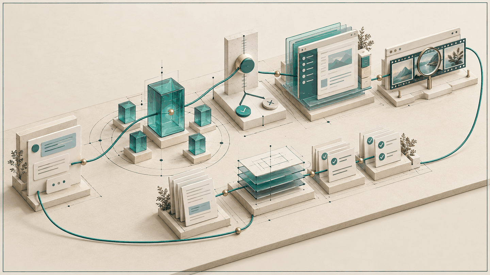
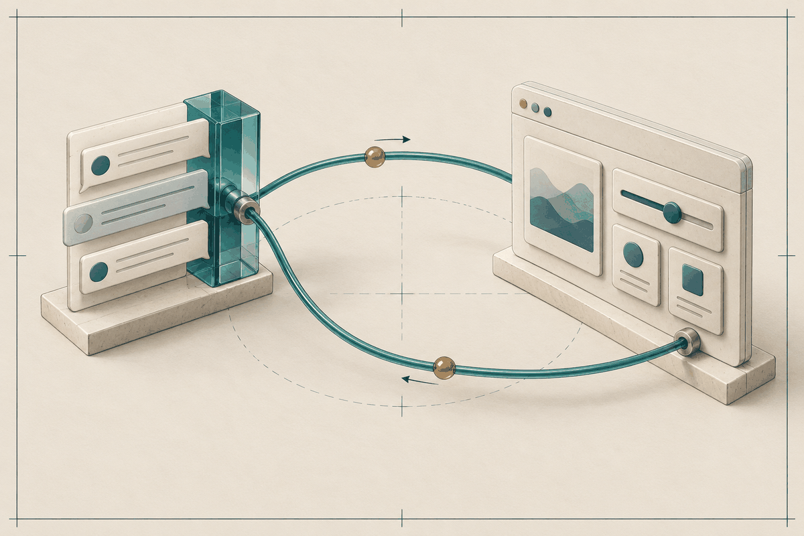
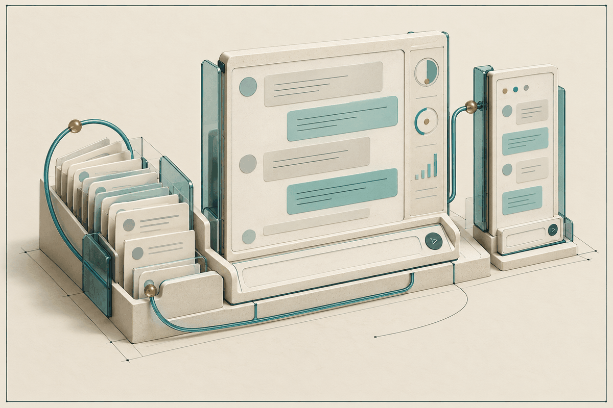
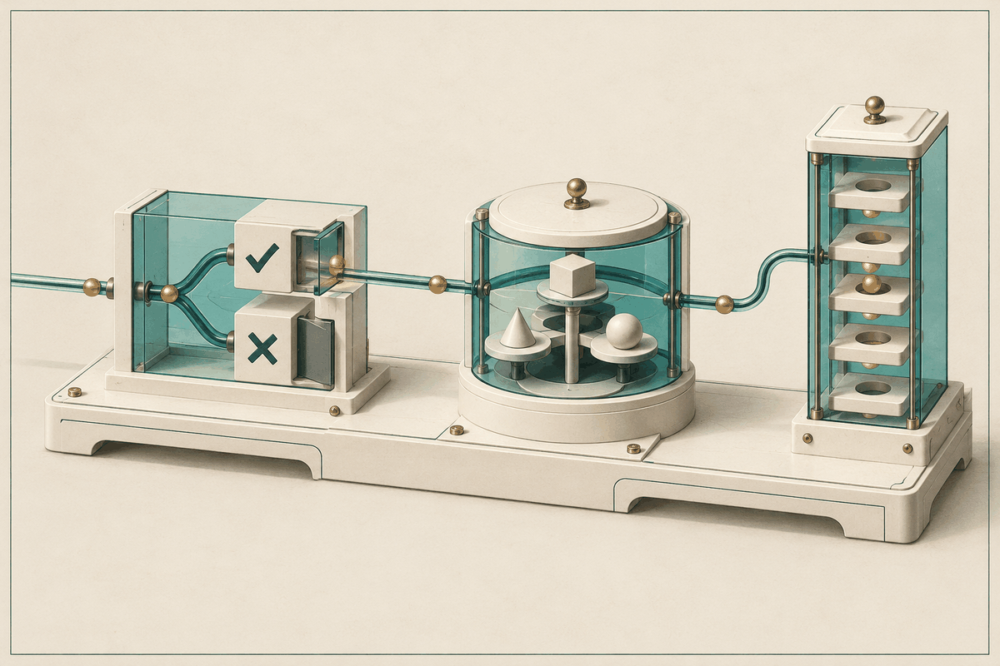

<p align="center">
  
</p>

<h1 align="center">common-dev</h1>

<p align="center"><em>一個不認得任何專案的工具箱，所以每個專案都用得上。</em></p>

`common-dev` 是一個 Claude Code marketplace，同時附上 Codex 版本。裡面的 skill 不綁定任何專案的品牌、路由、port 或帳號，裝進哪個 repo 都能用。

## 設計理念

- **通用，不認專案。** skill 只帶通用預設，技術棧與領域預設都可覆寫；專案自己的事實寫在使用者專案裡（例如 `.claude/test-template/`），不寫死進 skill。
- **Claude 為本，Codex 手工移植。** `plugins/` 是 source of truth，`codex/plugins/` 在同一個變更裡手動移植，兩邊內容相同，只保留 Codex 必要的差異。
- **主線決策，副手執行。** 邊界清楚、可以獨立驗證的工作派給較便宜的 sidekick；分析、決策與驗收留在主線。
- **驗證勝過宣稱。** 宣告完成前先跑機器檢查；build、mock、health response 不能替代真正的結果；條件不足時 fail closed，不猜、不頂替。
- **實驗與穩定分開。** 實驗技能放在需自行安裝的 Common Lab，不取代穩定版；測量紀錄留在 `docs/experiments/` 當歷史。
- **說繁體中文。** 給人看的輸出預設用繁體中文，使用者明確要求才換語言。

## Plugin 一覽

<table>
  <tr>
    <td width="50%" valign="top">
      <br>
      <strong><a href="docs/plugins/common.md">common</a></strong> · 預設啟用<br>
      日常開發輔助：prompt 優化、sidekick 派工、目標定義、長程戰略推進、決策地圖，以及白話重講與視覺講解。
    </td>
    <td width="50%" valign="top">
      <br>
      <strong><a href="docs/plugins/analysis-estimation.md">analysis-estimation</a></strong> · 預設啟用<br>
      把陌生的 RFP／SOW 展成可追溯的需求、架構與 BDD 驗收，並對新建、升版、CR 案做有依據的人天初估。
    </td>
  </tr>
  <tr>
    <td valign="top">
      <br>
      <strong><a href="docs/plugins/test-utils.md">test-utils</a></strong> · 預設啟用<br>
      E2E 與瀏覽器工具：AI 撰寫可雙擊執行的 Playwright 測試、人工錄製轉測試、agent 端 UI 除錯。
    </td>
    <td valign="top">
      <br>
      <strong><a href="docs/plugins/linkstart.md">linkstart</a></strong> · 預設啟用 · Preview<br>
      讓 agent 產出的互動 HTML 或 localhost App，在回合結束後仍能把事件送回產出它的同一條 session。
    </td>
  </tr>
  <tr>
    <td valign="top">
      <br>
      <strong><a href="docs/plugins/common-mod.md">common-mod</a></strong> · 預設啟用 · Claude 專屬<br>
      Claude Code 介面裡的 mod：輸入框上方的狀態列、回想過去的對話、側聊面板。
    </td>
    <td valign="top">
      <br>
      <strong><a href="docs/plugins/common-lab.md">common-lab</a></strong> · 實驗性（需自行安裝）<br>
      TypeSafe Jev 實驗技能：是非、挑選、評分的快速判斷，以及在正式技能判斷點加上 Jev 讀數的疊加版。
    </td>
  </tr>
</table>

## 快速開始

**Claude Code**：加入 marketplace，預設啟用的 plugin 會直接出現。

```text
/plugin marketplace add https://github.com/TLOGBen/common-dev-plugin.git
/plugin install common-lab@common-dev   # 選用：實驗版
```

**Codex**：加入 marketplace，再逐一加入要用的 plugin（Codex 沒有 `common-mod`）。

```bash
codex plugin marketplace add https://github.com/TLOGBen/common-dev-plugin.git
codex plugin add common@common-dev
codex plugin add analysis-estimation@common-dev
codex plugin add test-utils@common-dev
codex plugin add linkstart@common-dev
```

Claude 用 `/<plugin>:<skill>` 呼叫，Codex 用 `$<skill>`。試試看：

```text
/analysis-estimation:cold-estimation 估一下這個案子要多少人天（附上需求文件或 repo 路徑）
/test-utils:gen-e2e-test 幫登入到下單這條流程寫一個 E2E 測試
/common:delegate 把這批 log 掃描派給便宜的 sidekick，找出所有逾時錯誤
```

停用、更新、本機安裝與 Codex 的兩種 marketplace 佈局，見 [安裝與管理](docs/install.md)。

## 延伸閱讀

- [文件索引](docs/README.md)：各 plugin 完整說明、安裝、開發與實驗紀錄
- [開發指南](docs/development.md)與 [`AGENTS.md`](AGENTS.md)：repo 結構、Codex 移植規則、驗證指令
- [CHANGELOG](CHANGELOG.md)
- [授權：MIT](LICENSE)
