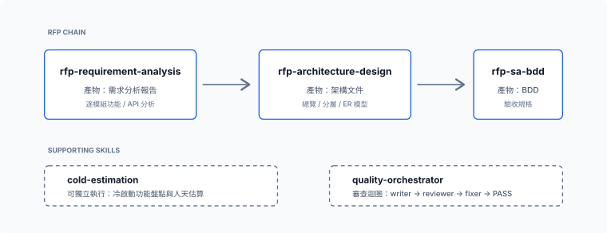

# common-dev

> 通用、與專案無關的開發工具箱，以 Claude Code marketplace（`common-dev`）形式發佈，並附 Codex 變體。所有 skill 都不綁定特定專案、路由或帳號，可混搭進任何 repo。

四個穩定 plugin 都設為 `defaultEnabled: true`；Claude 與 Codex marketplace 另提供需自行安裝、裝後即啟用的 `Common Lab（實驗性）`，不會取代穩定版 Common。

## 安裝

### Claude Code

加入 marketplace：

```text
/plugin marketplace add https://github.com/TLOGBen/common-dev-plugin.git
```

四個 plugin 都預設啟用；不需要的套件可用 `claude plugin disable <plugin-name>` 個別停用。若既有安裝尚未包含某個 plugin，可明確安裝：

```text
/plugin install test-utils@common-dev
/plugin install analysis-estimation@common-dev
/plugin install linkstart@common-dev
/plugin install common@common-dev
/plugin install common-lab@common-dev   # 實驗版
```

### Codex

```bash
codex plugin marketplace add https://github.com/TLOGBen/common-dev-plugin.git
codex plugin add test-utils@common-dev
codex plugin add analysis-estimation@common-dev
codex plugin add common@common-dev
codex plugin add common-lab@common-dev
codex plugin add linkstart@common-dev
```

## 內容一覽

### Skills Lab：實驗版

實驗技能統一由 **Common Lab 0.6.0** 提供，已列入 Claude 與 Codex marketplace，需自行選擇安裝。原 Common、Baransu、Estimate Lab 合併成單一套件；以「指引優先，針對反覆失誤設置控制」保留各技能的行為與驗收邊界。

- [0.2.0 逐技能改動、規模邊界與驗證結果](docs/experiments/lab-v0.2.0/README.md)
- [三個實驗包的歷史紀錄](docs/experiments/README.md)
- [Common 0.1.x 歷史實驗說明](docs/experiments/common-lab/README.md)
- [A/B 計畫與測量限制](docs/experiments/common-lab/RUN.md)
- [實測發現與限制（持續補充，非終報）](docs/experiments/common-lab/RESULTS.md)

目前統一 Lab 套件位於 `plugins/common-lab/`（Claude source）與 `codex/plugins/common-lab/`（Codex 產出），版本 0.6.0，整合 16 個技能與 4 個 bundled agents。Skill 名稱與資料夾移除 `lab-` 前綴，例如 `show-me`、`strategic-advance`、`estimate`；與正式版並存時，從技能選單選取 Common Lab 所屬項目，或使用帶套件識別的技能連結。Claude 使用 `/common-lab:<skill>`。`docs/experiments/` 保留為歷史測量紀錄，不能代表目前套件；舊版凍結包已移出工作樹，需要時從 Git 歷史取回；暫存安裝驗證也不代表目前 App 已載入新版。

| Plugin | Skills | 預設啟用 | 做什麼 |
|--------|:------:|:--------:|--------|
| [`common`](#common--通用工具) | 11 | ✅ 預設啟用 | Prompt 優化、sidekick 派工、目標定義、戰略推進、白話重講，以及 wayfinder 決策地圖與四個附屬 Skill |
| `common-lab` | 16 | 🧪 自行安裝 | 統一 Common、Baransu、Estimate 實驗技能：指引、派工、視覺說明、戰略推進、驗收與估算 |
| [`test-utils`](#test-utils--e2e-測試工具) | 3 | ✅ 預設啟用 | E2E 與瀏覽器工具：AI 撰寫測試、人工錄製轉測試、agent 端 UI 除錯 |
| [`analysis-estimation`](#analysis-estimation--分析與評估) | 6 | ✅ 預設啟用 | 既有系統方案／人天評估，以及把陌生 RFP / SOW 展成可追溯的需求、架構、BDD 驗收與工時估算 |
| [`linkstart`](#linkstart--htmlapp-回連-origin-session-preview) | 1 | ✅ 預設啟用 | 用單一入口把 agent 產出的互動 HTML／localhost App 接回產出它的同一條 Claude Code session 或 Codex thread |


> Claude 與 Codex marketplace 各提供四個預設啟用的穩定 plugin，以及需自行安裝的 `common-lab`。Claude skill 以 `/<plugin>:<skill>` 呼叫，Codex skill 以 `$<skill>` 呼叫。

## `test-utils` — E2E 測試工具

三個互補的 skill，用 `/test-utils:<skill>` 呼叫。

| Skill | 做什麼 | 什麼時候用 |
|-------|--------|-----------|
| `estimate` | 盤點陌生既有系統的升版、CR 或混合需求，從客戶成果、成功鏈與技術證據形成可行方案及 PM 可說明的人天估算。 | 既有系統要先理解現況、比較方案再估人天；不執行實際改造或正式商務報價。 |
| `gen-e2e-test` | 產出一個**自帶相依、可雙擊執行**的 Playwright 測試：跑完整流程、被動側錄每一個 API 呼叫，並輸出 Markdown + HTML 報告。產物是一個自帶 `package.json` 的資料夾，可直接交給同事。 | 由 AI 直接撰寫測試，不需人工錄製。 |
| `gen-e2e-record` | 開 Playwright **codegen** 讓人實際操作錄一遍，再把錄製轉成 `gen-e2e-test` 風格的測試（用真實互動產生的真實 selector）。依賴 `gen-e2e-test`。 | 流程互動多、selector 難猜時。 |
| `dev-browser` | 透過 `dev-browser` CLI 做具持久頁面狀態的 **agent 端**瀏覽器除錯：檢查 console、DOM、API response、畫面與修正後結果。 | agent 要直接互動式排查或驗證 UI，而不是產出可散佈測試時。 |

`gen-e2e-test` 負責由 AI 直接撰寫，`gen-e2e-record` 負責把使用者實際操作轉成同格式測試；`dev-browser` 則保留給 agent 的即時 UI 排查、API 驗證與修正後複驗。

### 相依

- **`gen-e2e-test` / `gen-e2e-record`**：需要 Node.js。產出的測試首次執行時自動裝 Playwright（`npm install`）；錄製用系統 Chrome（`--channel chrome`）。
- **`dev-browser`**：需要外部 `dev-browser` CLI：
  ```bash
  npm install -g dev-browser && dev-browser install
  ```
  在 settings 允許 `Bash(dev-browser *)`；Playwright MCP 可作為備援。

### 專案端記憶庫

`gen-e2e-*` 會把站台專屬事實（登入片段、環境眉角、難搞的 selector、驗證過的流程）存進你專案的 `.claude/test-template/`，透過內附的 `query.py` 查詢。通用指引留在 skill 裡，專案事實絕不寫死進 skill。

## `analysis-estimation` — 分析與評估

把一份陌生的 RFP / SOW 展成可追溯的分析、架構、驗收規格與工時估算。用 `/analysis-estimation:<skill>` 呼叫，輸出繁體中文。

| Skill | 做什麼 | 什麼時候用 |
|-------|--------|-----------|
| `estimate` | 盤點既有系統的升版／CR，從成果與證據形成方案及人天；HTML 可逐包展開頁面、API、檔案、基準公式與會改變估算的主動發現。 | PM 要確認陌生既有系統「改什麼、為何是這些人天」時。 |
| `rfp-requirement-analysis` | 把 RFP / 需求規格書展成「需求分析報告 + 逐模組功能/API 分析」，全程可追溯。**鏈的第 1 段。** | 手上有原始 RFP/SOW，要先盤出可機械比對的功能清單。 |
| `rfp-architecture-design` | 把第 1 段輸出落成架構文件（總覽 + 請求生命週期、前端、後端分層、命名規範、ER 模型）。**第 2 段。** 預設 Vue3/Spring Boot，可覆寫。 | 已有需求分析，要出系統架構。 |
| `rfp-sa-bdd` | 把每個功能展成 BDD 驗收規格（Goal／三段式 REQ 編號／繁中 Gherkin），銜接下游 TDD 的 `requirement.md`。**第 3 段。** | 要可機械驗收的驗收條件。 |
| `cold-estimation` | 對陌生專案做冷啟動功能盤點 + 人天估算：subagent fan-out、批判到乾涸、套費率算術。 | 「估一下這個案子要多少人天。」 |
| `quality-orchestrator` | 通用 writer→reviewer→fixer 審查迴圈，驅動上述 producer 跑到 PASS，最後做跨 task 覆蓋對帳。 | 要帶審查把關地批次產出上述文件。 |

三個 `rfp-*` skill 串成一條鏈（需求分析 → 架構設計 → SA/BDD）；`estimate` 面向既有系統的成果／方案／人天推導，`cold-estimation` 則面向陌生專案文件的冷啟動估算。所有技術棧與領域預設都可覆寫：skill 只帶通用預設，不綁定特定專案。



## `common` — 通用工具

不綁定特定情境的通用開發輔助；Claude 用 `/common:<skill>`，Codex 用 `$<skill>` 呼叫。

| Skill | 簡介 |
|-------|------|
| `better-prompts` | 依 Claude 與 GPT-5.x prompting guidance 審核、改寫、起草或遷移 prompts 與 agent instructions。 |
| `delegate` | 將邊界清楚、可驗證的工作派給 native sub-agent、Codex CLI 或 Claude CLI；Codex 可原生 pin model／effort，Fast 與精確 profile 另保留 CLI fallback。 |
| `define-goal` | 把模糊意圖整理成有驗證證據、明確邊界與停止條件的可驗收目標。 |
| `strategic-advance` | 鎖定可驗收的戰略目標，以即時情報、單一主攻與可驗證的一動持續推進長期任務；內建自含 HTML 沙盤 renderer，直接 render，不另設環境 preflight 或 legacy mode。 |
| `wait-what` | 停下目前工作，從斷掉的那個連結開始，按「哪裡沒懂」挑講法重講；純文字，圖另叫 show-me；只在明確叫用時觸發。 |
| `wayfinder` | Matt Pocock 原版流程（目的地、霧、前線、四種決策票、一 session 一票）落在本地 markdown；內建自含 HTML 地圖 renderer（含 Current focus 檢視）。只在明確叫用時觸發。 |
| `show-me` | HumanLayer 原版：用最小的視圖（pseudocode、call tree、diff、mermaid，必要時一頁 HTML）把當前話題講清楚。 |
| `grilling` | Matt Pocock 原版：以設計樹分輪訪談，事實模型自查、決定由人下，直到前線為空。 |
| `domain-modeling` | 釐清專案領域語言，將共識寫入 `CONTEXT.md`，必要時記錄 ADR。 |
| `research` | 派背景 agent 查證一手來源，將附引用的發現整理成 repo 內的 Markdown。 |
| `prototype` | 用可拋棄的邏輯 demo 或 UI variants 快速回答設計問題，再把驗證結果折回正式實作。 |

## `linkstart` — HTML／App 回連 Origin Session（Preview）

**LinkStart v1 Preview：Stable core + Preview platform adapters** 讓互動式 HTML 或 localhost App 在原 turn 結束後，仍能透過每位 OS 使用者一個的本機 Daemon，把事件送回產出它的同一條 Origin Session，並在同一個 App 收到 Agent Feedback；不靠 `claude -p`、`codex -p`、Agent SDK subprocess 或替代 session。

目前 `linkstart` plugin version 是 `0.2.2`，內嵌 Runtime `0.1.3`。

唯一 public skill 是 `link-start`。它在內部依序處理 Runtime／Daemon、Origin attach/rebind、App Manifest 註冊／launch，以及 private context 驅動的 `arm`／`respond` monitor flow；先辨識目前 host，再只讀對應的 `claude-code.md` 或 `codex.md` reference。

Claude Code 使用 `/linkstart:link-start <manifest.json>`；Codex 使用 `$link-start <manifest.json>`。App 回答仍只是 untrusted input，不會變成 tool approval、permission 或 scope expansion。

Monitor compatibility 不再要求模型手工串 `wait → ack → feedback → wait`。Attach 後把 state dir、`connectionId` 與 connection capability 注入 `0600` private context；`arm` 只讀 context 並等待一則 Event，`respond --payload <json>` 自動推導 pending Event/App identities、送 Delivery Ack、以 stable generated `feedbackId` 寫入 Feedback，接著進入下一次 bounded wait。Claude 用 attached background tool call 讓 completion 喚醒同一 session；Codex 用同一 wrapper 做 bounded foreground wait。

```console
printf '%s' "$CONNECTION_CAPABILITY" | runtime.py context create \
  --context "$CONTEXT" --state-dir "$STATE_DIR" \
  --connection-id "$CONNECTION_ID" --capability-stdin --json
runtime.py arm --context "$CONTEXT" --timeout-seconds 300 --json
runtime.py respond --context "$CONTEXT" --payload '{"message":"已收到"}' \
  --timeout-seconds 300 --json
runtime.py close --context "$CONTEXT" --json
```

Capability 不出現在 stdout；`close` 刪除本機 ephemeral secret，但不冒稱已完成 Runtime-side revoke。完整 attach/register/launch schemas 以 bundled Runtime `help --json` 為準，兩份 host reference 已提供 exact examples，模型不需讀 Rust source。

平台 adapter 目前分級如下：Claude Channel 是 Research Preview，通過 live self-test 的 Monitor 是 Experimental compatibility；Codex 只 allowlist 經完整 MOP／MOE 驗證的 LinkStart-owned app-server（初始為 `0.149.1`），standalone embedded TUI 不支援 hot takeover。未知版本、schema drift、Origin process offline 或同 session 證據不足都 fail closed。

Runtime 不從網路下載，也不從 `PATH` 猜測；plugin 只直接執行並驗證這三個 release artifact：

```text
plugins/linkstart/skills/link-start/assets/
├── checksums.json
└── bin/
    ├── linux-x64-musl/linkstart
    ├── windows-x64/linkstart.exe
    └── macos-universal/linkstart
```

目前內嵌 GitHub Release `v0.1.3`（workflow run `33049940902`）。缺少 exact binary、SHA-256、size、release tag provenance 或 Unix executable mode時會回 `runtime_binary_missing`／`runtime_binary_invalid`，不得下載或使用系統安裝版本頂替。發布驗收把 MOP（機制確實執行）與 MOE（真 App Event 回到同一 Origin Session，真 Feedback 回到同一 App Instance）分開；build、mock、health response 都不能替代 MOE。

## 專案結構

```text
common-dev-plugin/
├── .claude-plugin/
│   └── marketplace.json          # Claude marketplace 目錄（source of truth）
├── .agents/plugins/
│   └── marketplace.json          # Codex marketplace（Layout A，git URL 安裝入口）
├── plugins/
│   ├── common/
│   │   ├── .claude-plugin/plugin.json
│   │   ├── agents/               # luna-max-sidekick
│   │   └── skills/               # better-prompts, delegate, define-goal, strategic-advance, wait-what, wayfinder, show-me（+ grilling/domain-modeling/research/prototype）
│   ├── test-utils/
│   │   ├── .claude-plugin/plugin.json
│   │   └── skills/               # gen-e2e-test, gen-e2e-record, dev-browser
│   ├── analysis-estimation/
│   │   ├── .claude-plugin/plugin.json
│   │   └── skills/               # estimate, rfp-*, cold-estimation, quality-orchestrator
│   └── linkstart/
│       ├── .claude-plugin/plugin.json
│       └── skills/link-start/    # 單一 public skill；Claude/Codex adapter references 與 exact Runtime assets
├── codex/                        # 由 Claude 源生成的 Codex 變體（勿手改）
│   ├── .agents/plugins/
│   │   └── marketplace.json      # Codex marketplace（Layout B，自包含佈局）
│   └── plugins/                  # common / test-utils / analysis-estimation / linkstart
│       └── common/.codex-agents/ # generated luna-max-sidekick.toml
└── AGENTS.md                     # Codex 對應結構與 codex-skill-transfer 重生流程
```

Claude Code 原則上是 source of truth，`codex/` 下的檔案由 `codex-skill-transfer` 從 `plugins/` 生成；使用者明確要求 inline port 時可先新增 Codex-only 內容。重生流程與 Codex 雙軌佈局詳見 [`AGENTS.md`](AGENTS.md)。

## 貢獻

- **保持 skill 通用**：不寫死專案品牌、路由、port 或帳號；skill 引用自帶檔案用 `${CLAUDE_PLUGIN_ROOT}/skills/<skill>/...`。
- **每次散佈變更都要 bump plugin `version`**（Claude Code 有快取）。
- 改完 Claude 源後，用 `codex-skill-transfer` 重生對應的 `codex/` 變體（轉換會丟掉 `templates/` 等非標準子目錄，需手動補回——見 `AGENTS.md`）。
- Commit 遵循 conventional commits（`feat`、`fix`、`refactor`、`docs`、`chore`）。

## License

MIT

### Common Lab 的 Show Me 來源

`show-me/SKILL.md` 完整保留 [HumanLayer 上游](https://github.com/humanlayer/skills/blob/main/plugins/show-me/skills/show-me/SKILL.md) 原文；Codex 版本由 transfer 產生平台適配。HumanLayer 的完整 MIT 版權與許可聲明保留在技能目錄的 `LICENSE`，不重複放進技能正文。
