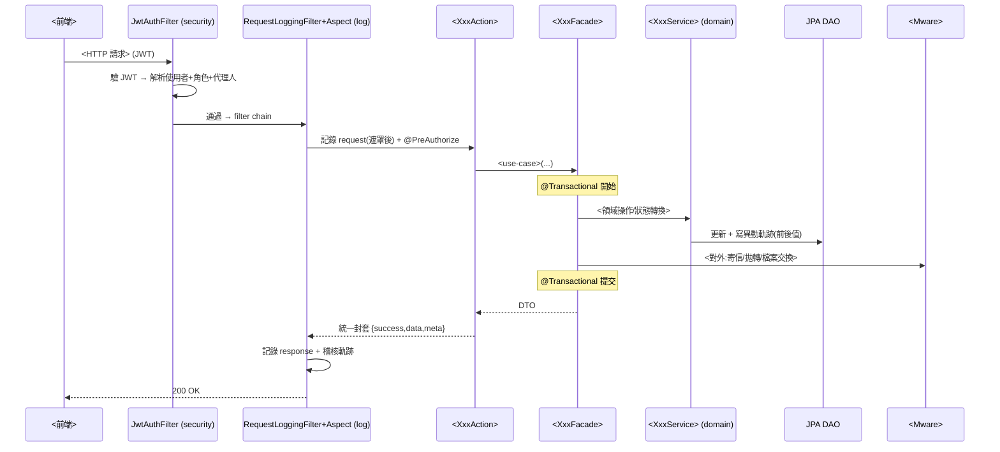

# <系統名> — 架構總覽

> 對應需求:`<需求分析報告路徑>`、`<功能API分析資料夾>`(<N> 檔 / <N> 功能 / ~<N> API)。
> 技術棧:**前端** <Vue 3 + Vite + Sass + Vuetify>;**後端** <Spring Boot 分層 Action → Facade → Service(Domain) → JPA DAO>,對外整合走 mware,共用元件走 util,日誌走 AOP+Filter+Logback,安全走 Spring Security + JWT。
> 部署:<Web Based、跨瀏覽器、F5 負載平衡、單一資料庫(SQL Server/Oracle)>。

---

## 一、整體分層

```
┌─────────────────────────────────────────────────────────────┐
│  Browser (<瀏覽器>)                                            │
│  <前端框架> SPA  ──  <build>  ──  <UI 庫>  ──  <樣式>          │
└───────────────┬─────────────────────────────────────────────┘
                │ HTTPS / REST (JSON 統一封套) + JWT Bearer
                ▼
┌─────────────────────────────────────────────────────────────┐
│  <Load Balancer>                                              │
└───────────────┬─────────────────────────────────────────────┘
                ▼
┌─────────────────────────────────────────────────────────────┐
│  <後端 App>                                                   │
│  [security]  JwtAuthFilter → Spring Security → SSO 驗證       │
│  [log]       RequestLoggingFilter + LoggingAspect(AOP)       │
│      ▼                                                        │
│  [action]    Controller — REST 端點 / DTO / @Valid           │
│      ▼                                                        │
│  [facade]    Use-case 編排 / @Transactional 邊界              │
│      ▼                                                        │
│  [service]   Domain 領域邏輯                                  │
│      ▼                  ▼                                     │
│  [dao/jpa] Repository  [mware] 對外服務(ExternalApiClient/    │
│      ▼                  FtpClient/MailSender)                 │
│  單一資料庫             [util] http/sftp/excel/date/mask/jwt  │
└─────────────────────────────────────────────────────────────┘
                                 ▼
   <外部系統清單:eHR · SSO · 會計 · 預算 · 採購 · EIP · 銀行>
```

---

## 二、各層職責(後端)

| 層 | package | 職責 | 不該做 |
|---|---|---|---|
| **action** | `<base>.<module>.action` | REST Controller;DTO;`@Valid`;統一封套;HTTP 狀態碼 | 不含商業邏輯、不直接碰 DAO/mware |
| **facade** | `…<module>.facade` | Use-case 編排;`@Transactional`;跨 service 組裝;DTO↔Domain | 不寫單一領域細節規則 |
| **service** | `…<module>.service` / `.domain` | 領域邏輯與模型 | 不知 HTTP/JSON;不直接做檔案交換 |
| **dao** | `…<module>.dao` + `.entity` | JPA Repository;Entity;查詢;分頁 | 不含商業規則 |
| **mware** | `<base>.mware` | 對外整合:API client/檔案交換/Mail;重試逾時斷路 | 不含業務決策 |
| **util** | `<base>.common.util` | 無狀態工具 | 不持有狀態、不反向依賴業務層 |
| **log** | `<base>.common.log` | LoggingAspect + RequestLoggingFilter + 稽核軌跡 | 不混業務;敏感欄位遮罩後才記錄 |
| **security** | `<base>.security` | SecurityConfig/JwtAuthFilter/SSO/@PreAuthorize | 不在 Controller 散寫權限 |

> 依賴方向單向向下:action → facade → service → (dao | mware);util/log/security 為橫切。

---

## 三、一個請求的生命週期(以「<代表流程，如 合約送簽>」為例)



---

## 四、橫切服務 ↔ 架構層 對應

| 共用服務(見功能API分析索引第二章) | 落在哪一層 |
|---|---|
| 線上簽核引擎 | facade(編排)+ service(狀態機)+ JPA(flow/instance)+ mware(mail) |
| 稽核軌跡 / 稽核日誌 | **log**(AOP 寫入)+ service(查詢)+ JPA(audit_log) |
| 檔案上傳 / 附件 | action(multipart)+ service + mware(外部存放) |
| 報表 / Excel 匯出 + 批次 | service + **util.ExcelUtil** + Batch/Quartz + mware(寄送) |
| 個資遮罩 / 解遮罩 | **util.MaskUtil** + AOP(輸出遮罩)+ log(access trail)+ security(授權) |
| 系統介接 | **mware**(client/檔案交換/mail)+ util(http/sftp/ftp) |

---

## 五、檔案清單

| 檔 | 內容 |
|---|---|
| `00-架構總覽.md` | 分層、請求生命週期、橫切對應 |
| `01-前端架構.md` | <前端> 結構、目錄樹、狀態、API 層、權限路由 |
| `02-後端架構.md` | 各層詳解、package 樹、交易/例外/封套 |
| `03-命名與開發規範.md` | 命名、DTO/Entity、例外、個資遮罩、設定分環境 |
| `04-資料模型ER.md` | 概念 ER、核心實體與關聯、關鍵設計重點 |
