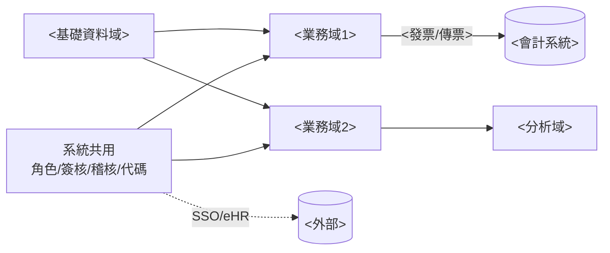
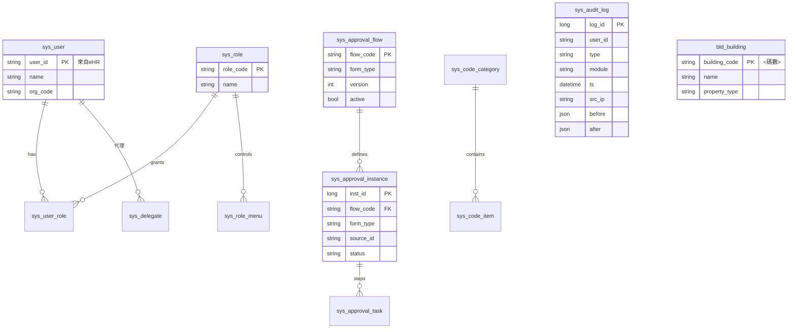

# 簡易資料模型 ER（概念層）

> 對應「單一資料庫」三層資料模型之**概念模型**初稿。僅列核心實體與主要關聯,欄位為代表性示意,細節於需求訪談確認。
> 表前綴:`sys_`系統共用、`bld_`<大樓>、`lse_`<出租>、`tnc_`<承租>、`acc_`帳務介接、`ops_`維運(依本系統領域命名)。

---

## 一、領域總覽（模組關係）



---

## 二、系統共用 + <基礎資料域>（sys_ / bld_）



---

## 三、<業務域1>（lse_）

```mermaid
erDiagram
  <agg> ||--o{ <child> : "一對多關係"
  <agg> ||--o{ <amendment> : "異動軌跡"
  <agg> ||--o{ <invoice> : "發票"

  <agg> { long id PK string no UK string status date start date end }
  <child> { long id PK long parent_id FK decimal amount }
  <amendment> { long id PK long parent_id FK string change_code date effective json before json after }
```

---

## 四、<業務域2>（tnc_）含 <特殊主題，如 IFRS16>

```mermaid
erDiagram
  <party> ||--o{ <payee> : "付款對象"
  <agg> ||--o{ <contract_party> : "出租人/月租分配"
  <agg> ||--o{ <special_data> : "<IFRS16 認列>"

  <party> { long id PK string name string uniform_no UK "唯一檢核(遮罩)" bool is_natural }
  <agg> { long id PK string no UK long workplace_id FK money month_rent string status }
  <special_data> { long id PK long contract_id FK string period decimal measure money cost }
```

---

## 五、關鍵設計重點

| 重點 | 體現 |
|---|---|
| **一對多聚合** | `<agg> 1—N <child>`(<說明>) |
| **異動全留軌跡** | `<amendment>` 存 before/after JSON,供歷史查詢與紅字 diff |
| **簽核通用** | `sys_approval_*` 以 `form_type + source_id` 掛任一單據,不為各模組重建 |
| **稽核通用** | `sys_audit_log` 單表記 access/operation/data-change/permission(保留 <N> 年) |
| **個資遮罩** | `is_natural=true` 之敏感欄位輸出遮罩,解遮罩寫 access trail |
| **帳務時序閘** | <放行→登帳→月結;押金未沖銷不可付租等狀態旗標控制> |
| **傳票拋轉** | `acc_voucher_entry` 為帳務共用拋轉源,target 平台參數化 |

> 註:本 ER 為概念層概覽,未含所有代碼表、報表快照表、批次 log 表;邏輯/實體模型(正規化、索引、加密欄位、分割)於系統分析階段展開。
