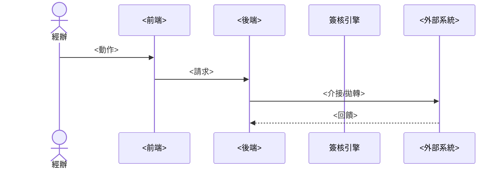

# <公司/系統名稱> RFP 分析

> 來源：`<RFP 檔名>`（<版本> / <日期>，<頁數> 頁）
> <專案背景一句話：隸屬專案、工期、階段>

---

## 1. 需求目的

<現況痛點一段：功能完整性 / 資料整合 / 報表分析 / 資安法規等無法滿足之處>。專案目標：

- <目標 1：建置/整合 ___ 模組於 ___>
- <目標 2：資料介接機制（列出要介接的外部系統）>
- <目標 3：數據分析與報表強化>
- 符合法規：<列出 RFP 點名的法規/準則>
- 建立<稽核軌跡與資安管控>機制。

<舊系統資料轉入需求（若有）>。

---

## 2. 拆包建議（<前端技術> 前端 / <後端技術> 後端）

<RFP 對架構的硬性要求：Web Based、跨瀏覽器、負載平衡、AOP…>。據此拆兩包：

### 前端包（<前端框架> SPA）
- <技術選型：框架 + 路由 + 狀態管理 + UI 元件庫>。
- 職責：<角色化選單與權限渲染、表單建檔、線上簽核 UI、報表查詢與匯出、儀表板/視覺化、個資遮罩前端呈現…>。

### 後端包（<後端框架>）
- <技術選型：框架 + 安全 + 批次 + 持久層>。
- 職責：<業務邏輯、簽核流程引擎、帳務、批次、稽核日誌、外部介接 API、個資加解密、ETL…>。
- DB：<資料庫選型；單一資料庫/Unicode/最小權限帳號…>。

> 跨包契約：RESTful API + 統一回應封套；AOP 處理 Logging / Security / 個資遮罩，與商業邏輯解耦。

---

## 3. 模組清單

| # | 模組 | 章節 |
|---|------|------|
| M1 | <模組名（職責摘要）> | <RFP 章節> |
| M2 | <…> | <…> |

> 註：<跨域子域、命名主題、特殊歸屬之說明>

---

## 4. 各模組功能

### M1 <模組名>
- <功能/子功能條列，盡量對齊 RFP 子章節編號>

### M2 <模組名>
- <…>

<逐模組列出>

---

## 5. 模組功能關係圖（Use Case Diagram）

```mermaid
graph TB
  subgraph Actors
    A1[<角色1>]
    A2[<角色2>]
  end
  subgraph <系統名>
    UC1((<用例1>))
    UC2((<用例2>))
  end
  A1 --> UC1 & UC2
  UC1 -.<介接>.-> EXT[(<外部系統>)]
```

> 註：<角色與外部系統辨析、共用基礎資料說明>

---

## 6. 主流程 Sequence（<主流程名稱，如 合約→發票→收款>）



<有多條主流程時，6b / 6c 分節再各畫一張>

---

## 7. 對外連線（介接）

| 對象 | 方向 | 內容 | 備註 |
|------|------|------|------|
| <外部系統> | 取得/推送/雙向 | <介接內容> | <格式/路徑/特殊條件> |

> 連線規範：<固定 Port、用 DNS 不用 IP、負載平衡、防火牆…等 RFP 明列規範>

---

## 8. 非功能性需求

### 登入與密碼
- <SSO 整合、密碼長度/更換週期/鎖定/不可寫死等具體規則>

### 稽核日誌（保留 ≥ <N> 年，可設定）
- <個資 access 軌跡、資料異動前後值、操作/登入軌跡、權限異動軌跡、log rotate…>

### 個資保護
- <最小個資、查詢/報表/匯出遮罩、機敏加密存 DB、測試庫不得存真實個資…>

### 安控與資安
- <掃描標準（OWASP/WebInspect/主機掃描）、弱點修補期限、最小權限帳號…>

### 資料模型 / 效能 / 維運 / 可用性
- <資料模型三層、資料成長評估、備援 RTO、負載平衡、交易完整性、壓力測試…>

### 批次排程
- <排程粒度、優先序與相依、失敗通知與 rerun、批次 log…>

### 交付 / 專案管理
- <文件交付、教育訓練、原始碼交付、保固 SLA、違約條款…>
