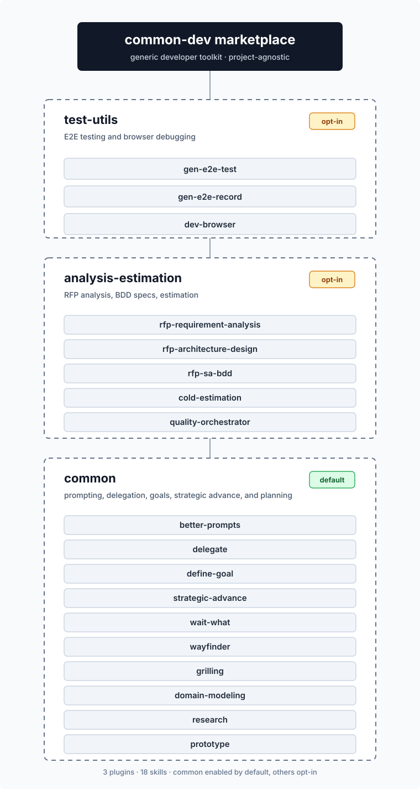

# common-dev 文件索引

回到 [首頁](../README.md)。

## Plugin 說明

| Plugin | Skills | 預設啟用 | 做什麼 | Codex |
|--------|:------:|:--------:|--------|:-----:|
| [`common`](plugins/common.md) | 12 | ✅ 預設啟用 | Prompt 優化、sidekick 派工、目標定義、戰略推進、白話重講，以及 wayfinder 決策地圖與四個附屬 Skill | ✅ |
| [`common-lab`](plugins/common-lab.md) | 16 | 🧪 實驗性（安裝後預設啟用） | TypeSafe Jev 的實驗技能：設定、是非／挑選／評分、Jev 輔助的瀏覽器除錯、提問前檢查，以及在正式技能判斷點加上 Jev 讀數的疊加版 | ✅ |
| [`common-mod`](plugins/common-mod.md) | 0（mod） | ✅ 預設啟用 | Claude Code 專屬的 mod：狀態列、回想過去的對話、側聊面板 | — |
| [`test-utils`](plugins/test-utils.md) | 3 | ✅ 預設啟用 | E2E 與瀏覽器工具：AI 撰寫測試、人工錄製轉測試、agent 端 UI 除錯 | ✅ |
| [`analysis-estimation`](plugins/analysis-estimation.md) | 5 | ✅ 預設啟用 | 既有系統方案／人天評估，以及把陌生 RFP / SOW 展成可追溯的需求、架構、BDD 驗收與工時估算 | ✅ |
| [`linkstart`](plugins/linkstart.md) | 1 | ✅ 預設啟用 | 用單一入口把 agent 產出的互動 HTML／localhost App 接回產出它的同一條 Claude Code session 或 Codex thread | ✅ |

各 plugin 的目前版本以 `plugins/<name>/.claude-plugin/plugin.json` 與 [CHANGELOG](../CHANGELOG.md) 為準。

> 上圖是較早期的結構圖（當時只有三個 plugin，部分標示為 opt-in），保留作為 skill 分組的示意；目前的 plugin 數量與啟用狀態以上表為準。Claude skill 以 `/<plugin>:<skill>` 呼叫，Codex skill 以 `$<skill>` 呼叫。

## 使用與維護

- [安裝與管理](install.md)：Claude Code 與 Codex 的安裝、啟用、停用、更新，以及 Codex 的兩種 marketplace 佈局
- [開發指南](development.md)：repo 結構、Claude source 與 Codex 移植、驗證指令、貢獻規則
- [`AGENTS.md`](../AGENTS.md)：Codex 移植規則與驗證流程的正式來源
- [CHANGELOG](../CHANGELOG.md)

## 實驗紀錄（歷史）

`docs/experiments/` 保留為歷史測量紀錄，不能代表目前套件。

- [三個實驗包的歷史紀錄](experiments/README.md)
- [0.2.0 逐技能改動、規模邊界與驗證結果](experiments/lab-v0.2.0/README.md)
- [Common 0.1.x 歷史實驗說明](experiments/common-lab/README.md)
- [A/B 計畫與測量限制](experiments/common-lab/RUN.md)
- [實測發現與限制（持續補充，非終報）](experiments/common-lab/RESULTS.md)
- [Claude 與 Codex plugin 平台對照（2026-10-08）](experiments/claude-codex-plugin-parity-20261008.md)

## 圖片

`images/` 收錄首頁主視覺（`hero.jpg`，Krea 2 產生）、各 plugin 概念圖（`plugin-<name>.png`），以及 [`marketplace-overview.svg`](images/marketplace-overview.svg)、[`rfp-pipeline.svg`](images/rfp-pipeline.svg) 兩張結構圖。
